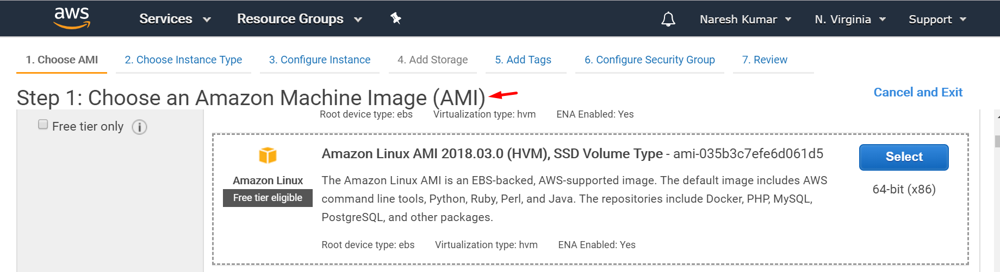

# AMI - Amazon Machine Image

* An AMI is a template that contains the software configuration (operating system, application server, and applications) required to launch your instance. 
* You can select an AMI provided by AWS, our user community, or the AWS Marketplace; or you can select one of your own AMIs.

