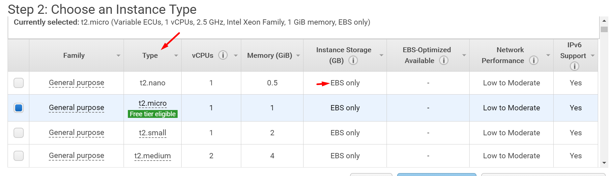

# Instance Types
* Amazon EC2 provides a wide selection of instance types optimized to fit different use cases. 
* Instances are virtual servers that can run applications. 
* They have varying combinations of CPU, memory, storage, and networking capacity, and give you the flexibility to choose the appropriate mix of resources for your applications. 
* Learn more about instance types and how they can meet your computing needs.

#### t2.micro ( 1 GB RAM )

