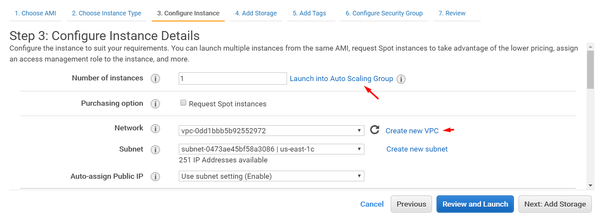
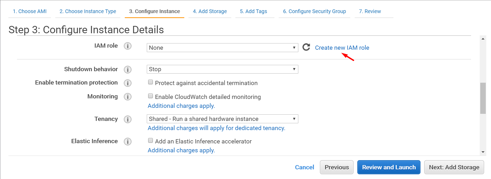

# Instance Details
* Configure the instance to suit your requirements. 
* You can launch multiple instances from the same AMI.

#### AutoScaling
* You can launch your instance(s) into an Auto Scaling Group and set up policies to automatically scale the number of instances in the group. 
* Auto Scaling will also automatically replace unhealthy instances.

#### Spot Instance
* You can request Spot instances to take advantage of the lower pricing

#### VPC – Virtual Private Cloud
-	Encapsulated protected group of aws resources
-	Abstraction of the LAN you have physically 

#### IAM - Identity Access Management
* assign an access management role to the instance

