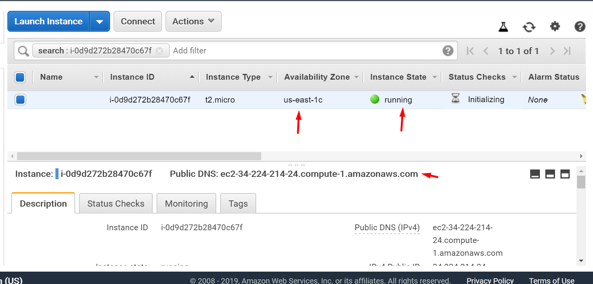

# Running Instance

#### Availability zones 
* The data centers which provide redundancy for AWS. Helps to keep our services up and running 99.9999999999%

#### Public IP
* http://ec2-34-224-214-24.compute-1.amazonaws.com

